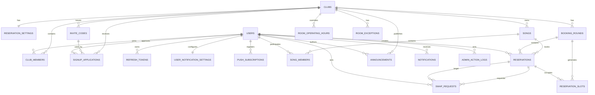

# 밴드 동아리 합주 관리 PWA — ERD / DB 설계

> 문서 목적: `REHEARSAL_PWA_POLICY.md`에서 확정된 정책을 PostgreSQL 테이블, 컬럼, FK, Unique, Index, 상태값, Transaction/Lock 전략으로 구체화한다.
> 정책 자체를 변경할 경우 먼저 정책 문서를 갱신한 뒤 이 문서를 동기화한다.

- 기준일: **2026-08-21**
- DB: **PostgreSQL**
- 상태: **4번 ERD / DB 설계 완료**

---
# 1. ERD / DB 설계 — 확정안

> 이 섹션은 앞의 확정 정책을 실제 PostgreSQL 테이블 구조로 옮긴 1차 ERD이다.
> 명확한 기술 선택은 확정안으로 반영했고, 운영 의미가 달라지는 항목만 마지막 `ERD 미결정 사항`에 남긴다.

## 39.1 DB 공통 원칙

- DB: PostgreSQL
- PK: `BIGINT`
- 날짜/시간:
  - 절대 시각은 `TIMESTAMPTZ`
  - 날짜만 필요한 값은 `DATE`
  - 일반적인 시간만 필요한 값은 `TIME`
  - `24:00` 경계를 표현해야 하는 운영시간/사용 불가 시간은 자정 기준 분(minute-of-day) `SMALLINT`를 사용
    - `00:00 = 0`, `10:00 = 600`, `22:00 = 1320`, `24:00 = 1440`
- 서버/표시 기본 타임존: `Asia/Seoul`
- DB에는 절대 시각을 `TIMESTAMPTZ`로 저장하고 애플리케이션에서 한국 시간으로 표시
- 상태값은 PostgreSQL Native ENUM 대신 `VARCHAR + CHECK`를 우선 사용
  - Flyway 변경과 JPA 매핑을 단순하게 유지하기 위함
- 생성/수정 시각은 기본적으로 `created_at`, `updated_at`
- 사용자/곡/예약 등 과거 이력이 필요한 데이터는 가능한 한 물리 삭제하지 않음
- 동시성 정확성은 PostgreSQL Transaction + Row Lock + DB Constraint 조합으로 보장
- 시간표의 최소 단위는 항상 30분

---
## 39.2 전체 관계 개요



---
# 2. 핵심 테이블

## 40.1 `clubs`

MVP는 단일 동아리지만 이후 확장을 위해 동아리 루트 테이블은 유지한다.

| 컬럼 | 타입 | 제약/설명 |
|---|---|---|
| id | BIGINT | PK |
| name | VARCHAR(100) | NOT NULL |
| created_at | TIMESTAMPTZ | NOT NULL |
| updated_at | TIMESTAMPTZ | NOT NULL |

MVP에서는 기본적으로 1개의 Club Row만 사용한다.

---

## 40.2 `users`

승인 완료된 실제 사용자 계정.

가입 승인 전 신청자는 `signup_applications`에 존재하고 승인 시 `users`가 생성된다.

| 컬럼 | 타입 | 제약/설명 |
|---|---|---|
| id | BIGINT | PK |
| login_id | VARCHAR(50) | 삭제 전 사용자만 UNIQUE |
| password_hash | VARCHAR(255) | 삭제 시 NULL 가능 |
| name | VARCHAR(50) | NOT NULL, 삭제 시 `삭제된 사용자` |
| status | VARCHAR(20) | `ACTIVE`, `DELETED` |
| deleted_at | TIMESTAMPTZ | NULL 가능 |
| created_at | TIMESTAMPTZ | NOT NULL |
| updated_at | TIMESTAMPTZ | NOT NULL |

### 주요 제약

```text
status IN ('ACTIVE', 'DELETED')
```

활성 사용자에 대해서만 로그인 아이디 중복을 막는 Partial Unique Index 사용:

```sql
CREATE UNIQUE INDEX uq_users_active_login_id
ON users (LOWER(login_id))
WHERE deleted_at IS NULL;
```

회원 탈퇴/삭제 시:

```text
login_id        → NULL 또는 비식별 값
password_hash   → NULL
name            → "삭제된 사용자"
status          → DELETED
deleted_at      → 현재 시각
```

---

## 40.3 `club_members`

사용자와 동아리의 관계 및 전역 Role.

| 컬럼 | 타입 | 제약/설명 |
|---|---|---|
| id | BIGINT | PK |
| club_id | BIGINT | FK → clubs |
| user_id | BIGINT | FK → users |
| role | VARCHAR(20) | `MEMBER`, `ADMIN`, `SUPER_ADMIN` |
| joined_at | TIMESTAMPTZ | NOT NULL |
| updated_at | TIMESTAMPTZ | NOT NULL |

### Unique

```text
UNIQUE(club_id, user_id)
```

### SUPER_ADMIN 1명 보장

```sql
CREATE UNIQUE INDEX uq_one_super_admin_per_club
ON club_members (club_id)
WHERE role = 'SUPER_ADMIN';
```

SUPER_ADMIN 삭제/강등 방지는 Service Layer에서도 추가 검증한다.

---

## 40.4 `signup_applications`

초대코드를 이용한 가입 신청 및 승인/거절 이력을 보존한다.

| 컬럼 | 타입 | 제약/설명 |
|---|---|---|
| id | BIGINT | PK |
| club_id | BIGINT | FK → clubs |
| invite_code_id | BIGINT | FK → invite_codes |
| login_id | VARCHAR(50) | NOT NULL |
| password_hash | VARCHAR(255) | 승인/거절 처리 후 NULL 가능 |
| name | VARCHAR(50) | NOT NULL |
| status | VARCHAR(20) | `PENDING`, `APPROVED`, `REJECTED` |
| reviewed_by | BIGINT | FK → users, NULL 가능 |
| reviewed_at | TIMESTAMPTZ | NULL 가능 |
| rejection_reason | VARCHAR(500) | NULL 가능 |
| approved_user_id | BIGINT | FK → users, NULL 가능 |
| created_at | TIMESTAMPTZ | NOT NULL |

동일 아이디 재신청 정책을 위해 `REJECTED` 기록은 유지하되, PENDING 신청만 중복 금지:

```sql
CREATE UNIQUE INDEX uq_pending_signup_login_id
ON signup_applications (club_id, LOWER(login_id))
WHERE status = 'PENDING';
```

승인/거절 완료 후 신청서의 `password_hash`는 제거한다.

---

## 40.5 `invite_codes`

현재/과거 초대코드 기록.

| 컬럼 | 타입 | 제약/설명 |
|---|---|---|
| id | BIGINT | PK |
| club_id | BIGINT | FK → clubs |
| code | VARCHAR(100) | UNIQUE, NOT NULL |
| created_by | BIGINT | FK → users |
| created_at | TIMESTAMPTZ | NOT NULL |
| revoked_at | TIMESTAMPTZ | NULL 가능 |

동아리당 유효한 코드는 1개만 허용:

```sql
CREATE UNIQUE INDEX uq_one_active_invite_code_per_club
ON invite_codes (club_id)
WHERE revoked_at IS NULL;
```

새 코드 발급 Transaction:

```text
현재 코드 revoked_at 설정
→ 새 코드 INSERT
```

---

## 40.6 `refresh_tokens`

Refresh Token을 DB에서 폐기/회전할 수 있도록 저장한다.

Access Token은 저장하지 않는다.

| 컬럼 | 타입 | 제약/설명 |
|---|---|---|
| id | BIGINT | PK |
| user_id | BIGINT | FK → users |
| token_hash | VARCHAR(255) | UNIQUE, NOT NULL |
| expires_at | TIMESTAMPTZ | NOT NULL |
| revoked_at | TIMESTAMPTZ | NULL 가능 |
| created_at | TIMESTAMPTZ | NOT NULL |
| last_used_at | TIMESTAMPTZ | NULL 가능 |

원문 Refresh Token이 아니라 안전한 Hash를 저장한다.

---

# 3. 사용자 알림

## 41.1 `user_notification_settings`

사용자별 합주 리마인더 설정.

| 컬럼 | 타입 | 제약/설명 |
|---|---|---|
| user_id | BIGINT | PK/FK → users |
| rehearsal_reminder_minutes | SMALLINT | NULL이면 알림 끄기 |
| updated_at | TIMESTAMPTZ | NOT NULL |

허용 값:

```text
NULL
10
30
60
120
1440
```

기본값:

```text
30
```

---

## 41.2 `push_subscriptions`

한 사용자가 여러 기기/브라우저에서 PWA를 사용할 수 있으므로 1:N.

| 컬럼 | 타입 | 제약/설명 |
|---|---|---|
| id | BIGINT | PK |
| user_id | BIGINT | FK → users |
| endpoint | TEXT | UNIQUE, NOT NULL |
| p256dh_key | TEXT | NOT NULL |
| auth_key | TEXT | NOT NULL |
| user_agent | TEXT | NULL 가능 |
| created_at | TIMESTAMPTZ | NOT NULL |
| last_success_at | TIMESTAMPTZ | NULL 가능 |
| disabled_at | TIMESTAMPTZ | NULL 가능 |

Push 실패가 반복되거나 Web Push API에서 만료 응답이 오면 `disabled_at`을 설정한다.

---

## 41.3 `notifications`

앱 내부 알림.

| 컬럼 | 타입 | 제약/설명 |
|---|---|---|
| id | BIGINT | PK |
| user_id | BIGINT | FK → users |
| type | VARCHAR(50) | 알림 종류 |
| title | VARCHAR(150) | NOT NULL |
| body | TEXT | NOT NULL |
| link_path | VARCHAR(500) | 클릭 시 이동할 PWA 경로 |
| dedupe_key | VARCHAR(200) | NULL 가능, 중복 발송 방지 |
| read_at | TIMESTAMPTZ | NULL 가능, 사용자가 알림 창고를 열어 확인한 시각 |
| dismissed_at | TIMESTAMPTZ | NULL 가능, X로 알림 창고에서 숨긴 시각 |
| created_at | TIMESTAMPTZ | NOT NULL |

대표 `type`:

```text
SWAP_REQUEST
SWAP_ACCEPTED
SWAP_REJECTED
RESERVATION_CHANGED
RESERVATION_CANCELED
ANNOUNCEMENT
BOOKING_OPEN_10_MIN
BOOKING_OPEN
REHEARSAL_REMINDER
```

`dedupe_key`가 존재할 경우 UNIQUE 처리하여 Scheduler 중복 실행에도 동일 알림이 여러 번 만들어지지 않도록 한다.

하단 `알림` 메뉴의 미확인 숫자는 `read_at IS NULL AND dismissed_at IS NULL`인 알림 수다. 사용자가 알림 메뉴/알림 창고를 열면 보관 중인 미확인 알림의 `read_at`을 현재 시각으로 일괄 기록하여 숫자를 0으로 만든다. 읽음 처리된 알림도 창고에는 계속 남고, 오른쪽 X를 누른 알림만 `dismissed_at`을 기록하여 목록에서 숨긴다. 알림 행은 물리 삭제하지 않는다.

---

# 4. 곡 / 팀

## 42.1 `songs`

| 컬럼 | 타입 | 제약/설명 |
|---|---|---|
| id | BIGINT | PK |
| club_id | BIGINT | FK → clubs |
| title | VARCHAR(150) | NOT NULL |
| status | VARCHAR(20) | `ACTIVE`, `ARCHIVED` |
| archived_at | TIMESTAMPTZ | NULL 가능 |
| created_by | BIGINT | FK → users |
| created_at | TIMESTAMPTZ | NOT NULL |
| updated_at | TIMESTAMPTZ | NOT NULL |

동일 제목 곡을 DB에서 강제로 UNIQUE 처리하지 않는다.

같은 곡을 서로 다른 구성으로 다시 준비할 가능성을 막지 않기 위함이다.

---

## 42.2 `song_members`

| 컬럼 | 타입 | 제약/설명 |
|---|---|---|
| id | BIGINT | PK |
| song_id | BIGINT | FK → songs |
| user_id | BIGINT | FK → users |
| session_name | VARCHAR(50) | NOT NULL |
| is_leader | BOOLEAN | NOT NULL DEFAULT FALSE |
| created_at | TIMESTAMPTZ | NOT NULL |
| updated_at | TIMESTAMPTZ | NOT NULL |

### Unique

```text
UNIQUE(song_id, user_id)
```

한 곡에 팀장은 최대 1명:

```sql
CREATE UNIQUE INDEX uq_one_leader_per_song
ON song_members (song_id)
WHERE is_leader = TRUE;
```

ACTIVE 곡이 정확히 1명의 팀장을 가지는지는 Service Layer에서 검증한다.

세션은 DB Enum이 아니라 문자열로 저장한다.

프론트에서 프리셋을 제공하되 자유 입력을 허용한다.

---

# 5. 예약 운영 설정 / 회차

## 43.1 `reservation_settings`

동아리 공통의 현재 예약 운영 기본값.

| 컬럼 | 타입 | 제약/설명 |
|---|---|---|
| club_id | BIGINT | PK/FK → clubs |
| allow_multiple_reservations | BOOLEAN | NOT NULL |
| default_booking_open_lead_minutes | INTEGER | 다음 회차 기본 예약 오픈 시점 계산용 |
| default_max_reservation_minutes | SMALLINT | NOT NULL |
| updated_by | BIGINT | FK → users |
| updated_at | TIMESTAMPTZ | NOT NULL |

`allow_multiple_reservations`는 회차와 독립적인 즉시 적용값.

`default_*` 값은 새 회차 자동 준비 시 직전/최신 정책을 이어받기 위한 기본값이다.

최대 예약 시간:

```text
30 / 60 / 90 / 120 / 150 / 180
```

MVP 최초 기본값:

```text
allow_multiple_reservations           FALSE
default_booking_open_lead_minutes     1680
default_max_reservation_minutes       90
```

---

## 43.2 `booking_rounds`

실제 합주가 이루어지는 월요일~일요일 회차.

| 컬럼 | 타입 | 제약/설명 |
|---|---|---|
| id | BIGINT | PK |
| club_id | BIGINT | FK → clubs |
| round_no | INTEGER | NOT NULL |
| start_date | DATE | 월요일 |
| end_date | DATE | 일요일 |
| booking_open_at | TIMESTAMPTZ | 예약 접수 시작 |
| booking_close_at | TIMESTAMPTZ | 기본 일요일 22:00 |
| max_reservation_minutes | SMALLINT | 해당 회차 Snapshot |
| created_at | TIMESTAMPTZ | NOT NULL |
| updated_at | TIMESTAMPTZ | NOT NULL |

### Unique

```text
UNIQUE(club_id, round_no)
UNIQUE(club_id, start_date)
```

상태 컬럼은 두지 않는다.

현재 상태는 시각으로 계산한다.

예:

```text
UPCOMING
BOOKING_OPEN
IN_PROGRESS
CLOSED
```

이렇게 해야 1회차 진행 중 + 2회차 예약 접수 중 상태를 동시에 자연스럽게 표현할 수 있다.

---

# 6. 동아리방 운영시간 / 사용 불가 시간

## 44.1 `room_operating_hours`

기본 운영시간은 애플리케이션 정책으로 `10:00~22:00`을 사용하고, 관리자 날짜별 Override가 있는 날만 행을 저장한다.

| 컬럼 | 타입 | 제약/설명 |
|---|---|---|
| id | BIGINT | PK |
| club_id | BIGINT | FK → clubs |
| operating_date | DATE | NOT NULL |
| open_minute | SMALLINT | 0~1410, 30분 단위 |
| close_minute | SMALLINT | 30~1440, 30분 단위 |
| reason | VARCHAR(500) | NOT NULL |
| updated_by | BIGINT | FK → users |
| created_at | TIMESTAMPTZ | NOT NULL |
| updated_at | TIMESTAMPTZ | NOT NULL |

### Constraint / Index

```text
CHECK(0 <= open_minute AND open_minute < close_minute AND close_minute <= 1440)
CHECK(open_minute % 30 = 0 AND close_minute % 30 = 0)
UNIQUE(club_id, operating_date)
INDEX(club_id, operating_date)
```

`24:00`을 정확하게 표현하기 위해 PostgreSQL `TIME` 대신 자정 기준 분을 저장한다.

Override 행이 없으면 해당 날짜는 `10:00~22:00`으로 계산한다. Override 삭제는 기본 운영시간 복원을 의미한다.

운영시간 단축으로 새 범위 밖이 되는 ACTIVE 예약은 같은 Transaction에서 Lock 후 취소하고 점유 슬롯을 해제한다. 해당 곡의 팀장 포함 `song_members` 전원에게 취소 알림을 생성하며 관리자 감사 로그를 남긴다.

---

## 44.2 `room_exceptions`

해당 날짜의 실제 운영시간 안에서 사용할 수 없는 시간 구간을 저장한다. 같은 날짜에 여러 행을 둘 수 있다.

| 컬럼 | 타입 | 제약/설명 |
|---|---|---|
| id | BIGINT | PK |
| club_id | BIGINT | FK → clubs |
| exception_date | DATE | NOT NULL |
| blocked_start_minute | SMALLINT | 0~1410, 30분 단위 |
| blocked_end_minute | SMALLINT | 30~1440, 30분 단위 |
| reason | VARCHAR(500) | NOT NULL |
| created_by | BIGINT | FK → users |
| created_at | TIMESTAMPTZ | NOT NULL |
| updated_at | TIMESTAMPTZ | NOT NULL |

### Constraint / Index

```text
CHECK(0 <= blocked_start_minute AND blocked_start_minute < blocked_end_minute AND blocked_end_minute <= 1440)
CHECK(blocked_start_minute % 30 = 0 AND blocked_end_minute % 30 = 0)
UNIQUE(club_id, exception_date, blocked_start_minute, blocked_end_minute)
INDEX(club_id, exception_date, blocked_start_minute)
```

구간은 해당 날짜의 실제 운영시간 안에 있어야 하고, 서로 겹치는 예외는 Service Layer에서 거절한다.

하루 전체 사용 불가는 그날의 실제 운영시간 전체를 한 행으로 표현한다.

### 기존 예약과 겹치는 사용 불가 시간 추가

새 예외 구간 저장 Transaction에서:

```text
1. 새 구간과 겹치는 ACTIVE Reservation 조회/Lock
2. 해당 예약들이 점유 중인 ReservationSlot Lock
3. 겹치는 Reservation만 CANCELED 처리
4. 해당 Slot reservation_id 해제
5. 각 예약에 cancellation_reason 기록
6. RoomException 시간 구간 저장
7. AdminActionLog 기록
8. 해당 곡의 팀장 포함 song_members 전원에게 취소 알림 생성
9. COMMIT
```

기존 예약을 다른 날짜로 자동 이동하지 않는다.

기존 V1~V8 migration은 수정하지 않고, 실제 스키마 전환은 V9 forward migration에서 처리한다.

---
# 7. 30분 예약 슬롯

## 45.1 `reservation_slots`

각 회차가 준비될 때 해당 주의 하루 전체 `00:00~24:00`에 대해 30분 단위 원자 슬롯을 생성한다.

```text
48 slots/day × 7 days = 336 slots/round
```

실제 예약 가능 여부는 날짜별 운영시간과 사용 불가 시간을 적용해 결정한다. 기본 날짜에는 `10:00~22:00` 범위만 활성 예약 시간이다.

50명 규모에서는 매우 작은 데이터량이다.

| 컬럼 | 타입 | 제약/설명 |
|---|---|---|
| id | BIGINT | PK |
| booking_round_id | BIGINT | FK → booking_rounds |
| slot_start_at | TIMESTAMPTZ | NOT NULL |
| reservation_id | BIGINT | FK → reservations, NULL이면 빈 슬롯 |
| created_at | TIMESTAMPTZ | NOT NULL |

### Unique

```text
UNIQUE(booking_round_id, slot_start_at)
```

### 화면 예약 슬롯 계산

`reservation_slots` 30분 행은 운영시간/최대 예약 시간 설정 변경과 관계없이 그대로 유지한다.

먼저 날짜별 실제 운영시간과 `room_exceptions`로 예약 가능한 원자 슬롯을 필터링한 뒤, 해당 회차 `max_reservation_minutes`를 기준으로 연속된 빈 구간을 일반 슬롯과 잔여 슬롯으로 계산한다.

기본 운영시간 `10:00~22:00`의 빈 하루라면:

```text
max_reservation_minutes = 30  → 일반 슬롯 24개
max_reservation_minutes = 60  → 일반 슬롯 12개
max_reservation_minutes = 90  → 일반 슬롯 8개
```

예약 또는 `room_exceptions` 때문에 연속 빈 구간이 최대 길이로 나누어지지 않으면 남는 30분 배수 구간을 `remainder slot`으로 별도 노출한다.

예:

```text
max_reservation_minutes = 90
11:00~11:30 예약됨

10:00~11:00  → remainder 60분
11:30 이후   → 연속 빈 구간 시작부터 90분 단위 재분할
```

기술적인 일반/잔여 구간과 실제 예약 시작 시각은 구분한다. 사용자가 특정 예약 길이를 고르면 30분 경계의 sliding start 중 실제로 점유 가능한 시작 시각을 반환한다.

설정 변경은 기존 ReservationSlot 행이나 기존 Reservation을 재생성하지 않는다.

### 예약 처리

예: 90분 예약

```text
18:00
18:30
19:00
```

3개의 Slot Row를 `SELECT ... FOR UPDATE`로 잠근다.

모두 `reservation_id IS NULL`이고 실제 운영시간/사용 불가 시간 검증을 통과할 때만 예약을 생성/점유한다.

동시 요청 시 같은 Slot Row에 대한 Lock 경쟁으로 선착순 정확성을 보장한다.

기존 회차에 아직 `10:00~22:00` 슬롯만 존재하는 경우 V9 forward migration에서 누락된 `00:00~10:00`, `22:00~24:00` 슬롯만 추가하고 기존 슬롯/예약은 유지한다.

---
# 8. 합주 예약

## 46.1 `reservations`

| 컬럼 | 타입 | 제약/설명 |
|---|---|---|
| id | BIGINT | PK |
| booking_round_id | BIGINT | FK → booking_rounds |
| song_id | BIGINT | FK → songs |
| start_at | TIMESTAMPTZ | NOT NULL |
| end_at | TIMESTAMPTZ | NOT NULL |
| status | VARCHAR(20) | `ACTIVE`, `CANCELED` |
| source | VARCHAR(20) | `TEAM`, `ADMIN` |
| created_by | BIGINT | FK → users |
| canceled_by | BIGINT | FK → users, NULL 가능 |
| cancellation_reason | VARCHAR(500) | NULL 가능 |
| canceled_at | TIMESTAMPTZ | NULL 가능 |
| created_at | TIMESTAMPTZ | NOT NULL |
| updated_at | TIMESTAMPTZ | NOT NULL |

예약 길이는 별도 컬럼으로 중복 저장하지 않고:

```text
end_at - start_at
```

으로 계산한다.

### 주요 Index

```text
INDEX(song_id, status)
INDEX(booking_round_id, start_at)
INDEX(start_at, end_at)
```

### 예약 생성 Lock 순서

일반 팀 예약 시 Deadlock 가능성을 줄이기 위해:

```text
1. 대상 Song Row Lock
2. 필요한 ReservationSlot Row들을 slot_start_at 오름차순 Lock
3. 복수 예약 정책 및 슬롯 상태 재검사
4. Reservation INSERT
5. Slot reservation_id UPDATE
6. COMMIT
```

Song Lock은 `복수 예약 불허` 상황에서 같은 팀의 같은 대상 회차 동시 신규 예약 2건이 모두 성공하는 것을 막기 위해 사용한다.

ADMIN이 복수 예약 정책을 Override하는 경우에도 슬롯 Lock은 반드시 수행한다.

ADMIN / SUPER_ADMIN의 신규 예약 생성과 연장 결과도 해당 시점의 `max_reservation_minutes`를 초과할 수 없다.

단, 최대 예약 시간이 낮아지기 전에 만들어진 더 긴 기존 예약은 이동 시 원래 길이를 유지할 수 있다.

---
# 9. 예약 이동 / 연장 / 단축 / 취소

별도 이력 테이블을 추가하지 않고 `reservations` + `reservation_slots`를 Transaction으로 수정한다. 관리자 강제 작업은 기존 `admin_action_logs`에 사유와 변경 전후 Snapshot을 남긴다.

## 이동

```text
Reservation Row Lock
→ 기존/새 Slot 전체를 시각 오름차순 Lock
→ 새 위치가 실제 운영시간 안인지 검증
→ RoomException / 다른 예약 충돌 검증
→ 기존 Slot 해제
→ 새 Slot 점유
→ Reservation start_at/end_at 변경
→ 알림 생성
→ COMMIT
```

예약 이동 시 원래 길이를 유지한다. 현재 최대 예약 시간이 기존 예약 길이보다 짧아졌더라도 이동은 가능하다.

## 연장

- 앞/뒤 모두 가능
- 30분 단위
- 새로 추가되는 슬롯 Lock
- 연장 결과는 현재 최대 예약 가능 시간 이내
- 실제 운영시간 / 사용 불가 시간 / 다른 예약 충돌 검증

## 단축

- 앞/뒤 모두 가능
- 30분 단위
- 최소 30분 유지
- 해제되는 Slot의 `reservation_id`를 NULL 처리

## 취소

```text
Reservation Row Lock
→ 점유 Slot Lock
→ Reservation ACTIVE → CANCELED
→ Slot reservation_id 해제
→ canceled_by / cancellation_reason / canceled_at 기록
→ 알림 생성
→ COMMIT
```

팀장이 수행한 이동/연장/단축/취소와 관리자의 강제 변경/취소 모두 알림 대상은 해당 예약의 `song_id`에 속한 **팀장 포함 `song_members` 전원**이다.

행동한 팀장 본인도 제외하지 않는다. 다른 팀/일반 동아리 회원/해당 곡 팀원이 아닌 관리자는 해당 예약 변경 알림을 받지 않는다.

ADMIN / SUPER_ADMIN의 강제 이동/연장/단축/취소는 사유가 필수이며 `admin_action_logs`에 기록한다.

---
# 10. 일정 교환

## 48.1 `swap_requests`

| 컬럼 | 타입 | 제약/설명 |
|---|---|---|
| id | BIGINT | PK |
| requester_reservation_id | BIGINT | FK → reservations |
| target_reservation_id | BIGINT | FK → reservations |
| requested_by | BIGINT | FK → users |
| responded_by | BIGINT | FK → users, NULL 가능 |
| status | VARCHAR(20) | PENDING/ACCEPTED/REJECTED/CANCELED/EXPIRED |
| requester_start_snapshot | TIMESTAMPTZ | 요청 당시 시작 |
| requester_end_snapshot | TIMESTAMPTZ | 요청 당시 종료 |
| target_start_snapshot | TIMESTAMPTZ | 요청 당시 시작 |
| target_end_snapshot | TIMESTAMPTZ | 요청 당시 종료 |
| requested_at | TIMESTAMPTZ | NOT NULL |
| responded_at | TIMESTAMPTZ | NULL 가능 |
| expired_at | TIMESTAMPTZ | NULL 가능 |

요청은 개인이 아니라 예약/팀 관계에 귀속되므로 팀장이 변경되어도 새 팀장이 이어서 처리 가능하다.

`requested_by`, `responded_by`는 실제 행동자를 감사 목적으로 기록한다.

### PENDING 교환 제약

- 하나의 예약은 동시에 하나의 `PENDING` 교환 요청에만 참여할 수 있다.
- 요청측/대상측 어느 쪽이든 이미 `PENDING` 교환에 참여 중인 예약은 새 교환 요청에 사용할 수 없다.
- 이 규칙은 Service Layer 검증과 Transaction Lock으로 보장한다.
- PostgreSQL에서 두 FK 컬럼을 가로지르는 단순 UNIQUE 하나로 표현하기 어렵기 때문에, 예약 Row Lock 후 `PENDING` 참여 여부를 조회/검증한다.

### 관리자 검토

ADMIN / SUPER_ADMIN은 전체 `PENDING` 교환 요청 목록을 조회할 수 있으며 관리자 권한으로 허가 또는 반려할 수 있다.

관리자 반려 시:

```text
status = REJECTED
responded_by = 관리자 user_id
responded_at = 현재 시각
```

관리자 허가 시에도 실제 교환 Transaction 직전에 두 예약/슬롯의 현재 상태를 다시 검증한다.

### 예약 변경 시 자동 만료

`PENDING` 교환에 참여한 예약이 다음 중 하나로 변경되면 관련 교환 요청을 즉시 `EXPIRED` 처리한다.

```text
이동
연장
단축
취소
```

상대 팀장에게 교환 요청 만료 알림을 생성한다.

### 교환 Transaction

```text
1. 두 Reservation을 ID 오름차순으로 Lock
2. 관련 모든 Slot을 시각 오름차순으로 Lock
3. 두 예약이 요청 당시 상태와 동일한지 검증
4. 각 팀이 원래 예약 길이를 유지할 수 있는지 검증
5. Slot 재배치
6. 두 Reservation start_at/end_at 변경
7. SwapRequest ACCEPTED
8. COMMIT
```

---

# 11. 공지

## 49.1 `announcements`

| 컬럼 | 타입 | 제약/설명 |
|---|---|---|
| id | BIGINT | PK |
| club_id | BIGINT | FK → clubs |
| title | VARCHAR(200) | NOT NULL |
| content | TEXT | NOT NULL |
| is_pinned | BOOLEAN | NOT NULL DEFAULT FALSE |
| author_user_id | BIGINT | FK → users |
| created_at | TIMESTAMPTZ | NOT NULL |
| updated_at | TIMESTAMPTZ | NOT NULL |
| deleted_at | TIMESTAMPTZ | NULL 가능 |

공지 삭제는 관리자 로그 보존과 알림 참조 안정성을 위해 Soft Delete로 처리한다.

---

# 12. 관리자 감사 로그

## 50.1 `admin_action_logs`

| 컬럼 | 타입 | 제약/설명 |
|---|---|---|
| id | BIGINT | PK |
| club_id | BIGINT | FK → clubs |
| actor_user_id | BIGINT | FK → users |
| action_type | VARCHAR(50) | NOT NULL |
| target_type | VARCHAR(50) | NOT NULL |
| target_id | BIGINT | NULL 가능 |
| reason | VARCHAR(500) | NULL 가능 |
| before_data | JSONB | NULL 가능 |
| after_data | JSONB | NULL 가능 |
| created_at | TIMESTAMPTZ | NOT NULL |

`before_data`, `after_data`는 관리자 강제 일정 이동/연장/단축/취소/교환/권한 변경 등의 상태 비교용 Snapshot이다.

주요 Index:

```text
INDEX(club_id, created_at DESC)
INDEX(actor_user_id, created_at DESC)
INDEX(target_type, target_id)
```

---
# 13. 예약/동시성 핵심 무결성 규칙

## 51.1 슬롯 중복 예약

하나의 30분 슬롯은 하나의 ACTIVE 예약만 점유한다.

`reservation_slots.reservation_id` 구조와 Row Lock으로 보장한다.

## 51.2 복수 예약 불허 동시 요청

같은 팀이 동시에 서로 다른 빈 시간을 두 번 요청하는 경우:

```text
Song Row Lock
→ 현재 ACTIVE 예약 수 재검사
```

를 통해 둘 다 성공하는 Race Condition을 차단한다.

## 51.3 예약 이동

기존 예약을 먼저 제거하지 않는다.

새 시간 확보까지 하나의 Transaction에서 처리한다.

## 51.4 교환

두 Reservation + 관련 Slot을 한 Transaction으로 처리한다.

둘 중 하나만 이동하는 상태는 존재하지 않는다.

## 51.5 Lock 순서

Deadlock 방지를 위해 항상:

```text
Reservation/Song ID 오름차순
Slot 시각 오름차순
```

으로 Lock 순서를 통일한다.

---

# 14. 주요 상태값

## User

```text
ACTIVE
DELETED
```

## ClubMember Role

```text
MEMBER
ADMIN
SUPER_ADMIN
```

## SignupApplication

```text
PENDING
APPROVED
REJECTED
```

## Song

```text
ACTIVE
ARCHIVED
```

## Reservation

```text
ACTIVE
CANCELED
```

## Reservation Source

```text
TEAM
ADMIN
```

## SwapRequest

```text
PENDING
ACCEPTED
REJECTED
CANCELED
EXPIRED
```

---

# 15. 필수 DB Index / Constraint 요약

```text
users
- active login_id partial unique

club_members
- unique(club_id, user_id)
- one SUPER_ADMIN per club partial unique

signup_applications
- one PENDING application per login_id partial unique

invite_codes
- one active invite code per club partial unique

songs
- index(club_id, status)

song_members
- unique(song_id, user_id)
- one leader per song partial unique

booking_rounds
- unique(club_id, round_no)
- unique(club_id, start_date)

room_exceptions
- unique(club_id, exception_date, blocked_start_time, blocked_end_time)
- index(club_id, exception_date, blocked_start_time)

reservation_slots
- unique(booking_round_id, slot_start_at)
- index(reservation_id)

reservations
- index(song_id, status)
- index(booking_round_id, start_at)

push_subscriptions
- unique(endpoint)

notifications
- unique(dedupe_key) when dedupe_key is not null
- index(user_id, read_at, created_at)

refresh_tokens
- unique(token_hash)

admin_action_logs
- index(club_id, created_at)
- index(actor_user_id, created_at)
```

---

# 16. 4번 ERD 진행 상태

```text
04 ERD / DB 설계

사용자 / 권한                 🟢
가입 신청 / 초대코드          🟢
인증 Refresh Token           🟢
곡 / 참여자 / 팀장            🟢
예약 공통 설정                🟢
예약 회차                    🟢
동아리방 예외                 🟢
30분 Slot 구조               🟢
예약                         🟢
예약 동시성                  🟢
예약 이동/연장/단축           🟢
교환 기본 구조               🟡
공지                         🟢
알림 / Push                  🟢
관리자 감사 로그              🟢
DB Index / Constraint        🟢
```

---

# 17. ERD 최종 확정 정책

## 17.1 교환 요청

```text
한 예약 = 동시에 하나의 PENDING 교환만 가능
```

ADMIN / SUPER_ADMIN은 전체 교환 신청 목록을 조회하고 허가/반려할 수 있다.

예약이 이동/연장/단축/취소되면 관련 `PENDING` 교환은 자동 `EXPIRED`.

## 17.2 동아리방 사용 불가 시간 예외

사용 불가 시간 구간을 추가하면 그 구간과 겹치는 기존 ACTIVE 예약만 관리자 강제 취소한다.

```text
겹치는 예약만 취소
→ 해당 Slot 반환
→ 사용 불가 구간 저장
→ 취소 알림
→ 관리자 로그
```

`10:00~22:00` 전체 구간을 등록한 경우에만 결과적으로 해당 날짜 예약 전체가 취소된다.

자동 재예약/재배치는 하지 않는다.

## 17.3 관리자 최대 예약 시간

관리자도 현재 설정된 `max_reservation_minutes`를 초과할 수 없다.

## 17.4 4번 ERD / DB 설계 상태

```text
04 ERD / DB 설계           🟢 완료
```

다음 단계:

```text
05 프로젝트 초기 세팅
```
